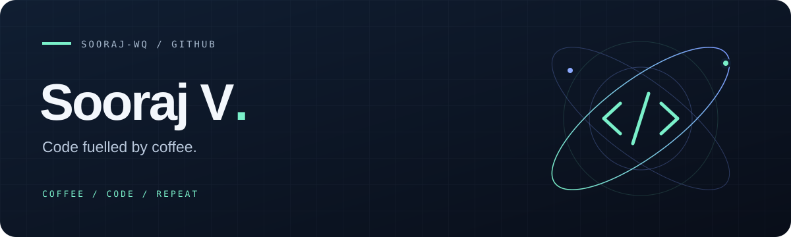

  

  <a href="#daily-brew">Daily brew</a>
  &nbsp;&nbsp;·&nbsp;&nbsp;
  <a href="#toolbox">Toolbox</a>
  &nbsp;&nbsp;·&nbsp;&nbsp;
  <a href="https://github.com/Sooraj-wq?tab=repositories">Around here ↗</a>

 

## Hey, I'm Sooraj.

Usually making something, breaking something, or grabbing another coffee. A little curiosity, a lot of experimenting, and one commit at a time.

 

## Daily brew

A little snapshot of what I've been up to — my contribution activity over the last 31 days.

  

coffee in. commits out. ☕

 

## Toolbox

Technologies represented in my public projects:

**`JavaScript`** &nbsp; **`Java`** &nbsp; **`CSS`**

<!-- Add other technologies here when you want to highlight them. -->
<!-- Optional: add a current project, learning focus, portfolio, or public contact link. -->

 

---

  Code fuelled by coffee. 
  <a href="https://github.com/Sooraj-wq">@Sooraj-wq</a>

